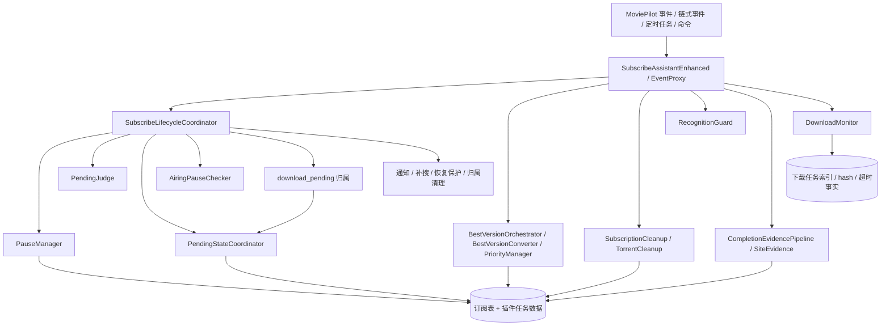
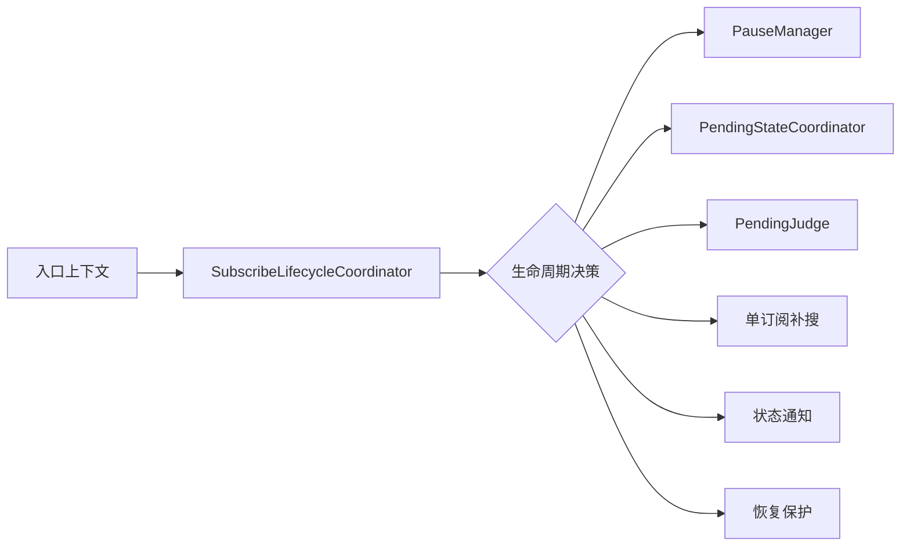
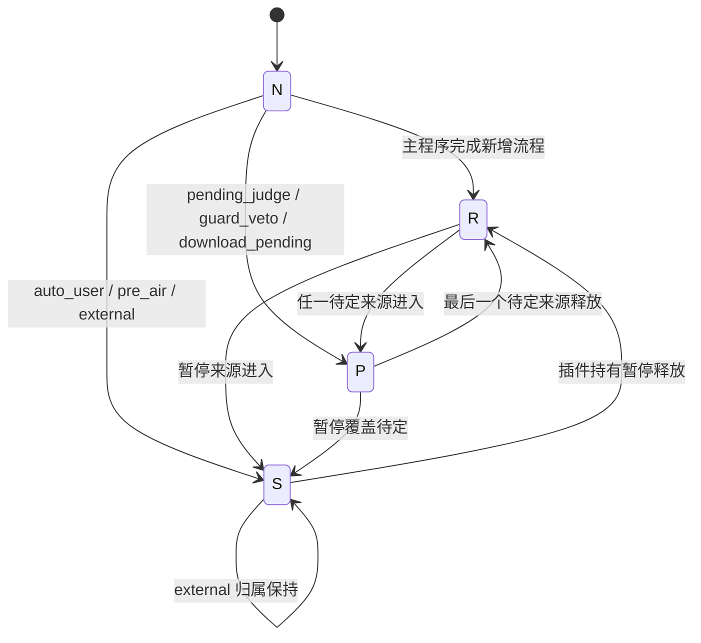
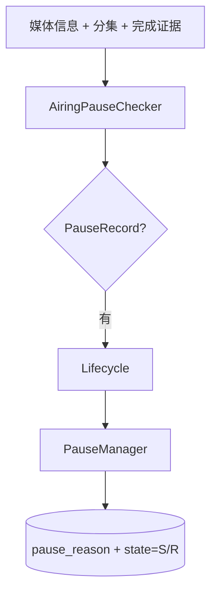
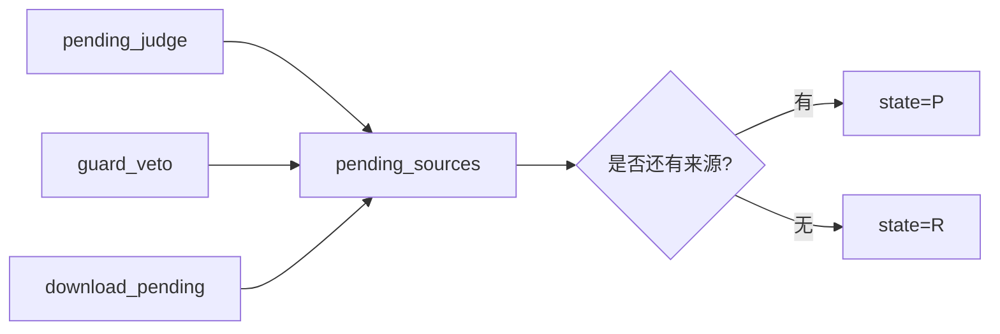
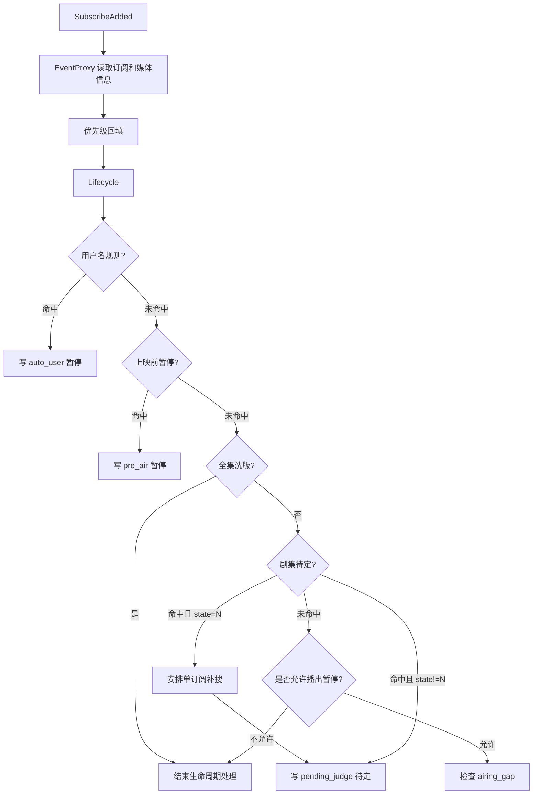
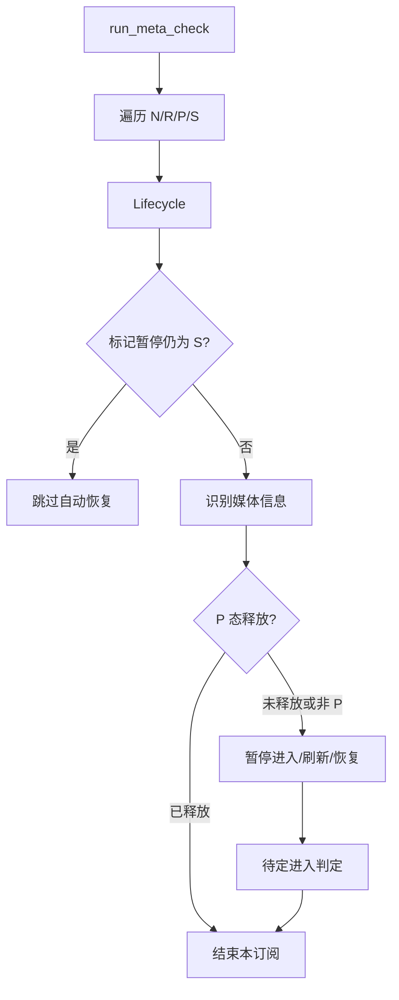
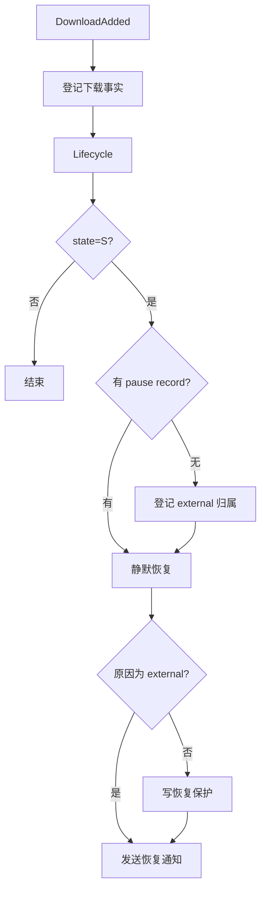

# 订阅助手（增强版）整体架构设计

## 设计目标

订阅助手（增强版）在 MoviePilot 订阅体系之上提供完成前观察、剧集待定、上映/播出暂停、下载待定、洗版编排、订阅清理、识别增强和站点证据能力。插件架构以订阅生命周期为主线，将状态归属、证据来源、资源清理和用户通知拆分为独立领域，避免入口逻辑直接组合复杂副作用。

架构约束：

- 入口层只解析事件、收集上下文并调用领域服务。
- 生命周期状态由统一生命周期层编排。
- 判定器只返回判定结果，不写订阅状态。
- writer 只维护自己负责的状态事实，不跨领域推导业务流程。
- 证据、诊断、审计和快照模块只提供输入事实，不直接拥有订阅生命周期状态。

## 总体结构



`SubscribeAssistantEnhanced` 是插件实例和依赖组装根。`EventProxy` 是事件代理，负责把主程序事件转换为插件内部调用。生命周期、待定、暂停、下载、洗版、清理、识别和证据模块通过明确接口协作。

## 入口层

入口层包含：

- 事件入口：订阅新增、订阅修改、订阅删除、下载新增、整理完成、插件命令。
- 链式事件入口：完成检查、集数刷新、资源选择、资源下载、整理拦截、数据重置。
- 定时任务入口：元数据巡检、待定释放、一致性检查、无下载检查、下载任务检查、洗版检查、完成校验、清理任务。
- 命令入口：用户通过插件命令触发的订阅操作。

入口层允许做：

- payload 校验和转换；
- 订阅、媒体信息、TMDB 分集等上下文读取；
- 非生命周期领域调用，例如优先级回填、识别增强、候选过滤、清理检查；
- 调用生命周期层执行订阅状态相关操作。

入口层不直接写 `state`，不直接组合暂停、待定、补搜、恢复保护和状态通知的顺序。

## 生命周期层

`SubscribeLifecycleCoordinator` 是订阅状态生命周期的统一编排层。凡是会影响以下事实的业务路径，都属于生命周期层职责：

- 主订阅状态：`N`、`R`、`P`、`S`。
- 暂停归属：`pause_reason`、`pause_since`、`pause_detail`。
- 待定归属：`pending_sources`、`source`、`reason`。
- 下载待定归属：`download_pending`。
- 状态变化派生副作用：补搜、状态通知、恢复保护、归属清理。

生命周期层不替代领域 writer。它负责决定跨领域顺序，并调用下游模块完成具体写入。



生命周期方法统一返回 `LifecycleResult`：

```python
@dataclass
class LifecycleResult:
    changed: bool = False
    stopped: bool = False
    state: str | None = None
    reason: str = ""
    message: str = ""
```

`changed` 表示状态或归属发生变化。`stopped` 表示入口后续生命周期流程应停止。`state`、`reason`、`message` 提供稳定的日志、命令回复和测试语义。

## 订阅状态模型

主程序订阅状态只表达用户可见状态：

- `N`：新增，仍处于主程序首次搜索窗口。
- `R`：启用，正常参与搜索与生命周期巡检。
- `P`：待定，存在至少一个插件持有的待定来源。
- `S`：禁用，存在用户、外部或插件持有的暂停事实。

插件归属状态解释 `P` 和 `S` 的原因。没有归属的 `P/S` 应被视为外部事实或残留事实，而不是默认归属于自动逻辑。



## 暂停领域

`PauseManager` 是暂停 writer。它维护：

- 暂停原因和详情；
- 暂停优先级；
- `S/R` 状态写入；
- 暂停和恢复通知去重；
- 恢复保护相关字段。

暂停原因采用优先级仲裁。`external` 代表用户或外部系统持有的暂停事实，并拥有最高优先级。`/subscribe_toggle` 产生的手动暂停也使用 `external`，通过 `pause_detail` 标明来源，例如“插件命令手动暂停”。

`AiringPauseChecker` 是暂停判定器。它根据上映日期、开播日期、下一集日期和完成证据返回 `PauseRecord` 或恢复判断，不写状态。



## 待定领域

`PendingJudge` 负责 `pending_judge` 来源的待定判定。它根据开播窗口、集数、air_date 和完成证据判断是否应进入待定。

`PendingStateCoordinator` 是多来源待定 writer。它维护：

- `pending_sources`；
- 主来源 `source`；
- 当前原因 `reason`；
- `P/R` 状态同步；
- 暂停覆盖待定时的归属清理。

待定来源包括：

- `pending_judge`：剧集信息待确认。
- `guard_veto`：完成前检查未通过，需要观察。
- `download_pending`：下载已发起但尚未完成整理或下载器确认。

任一来源存在时订阅保持 `P`。只有最后一个来源释放后，订阅才恢复 `R`。



## 下载领域

`DownloadMonitor` 负责下载事实，不负责跨领域生命周期决策。它维护：

- 下载任务索引；
- hash 和无 hash 下载的临时匹配；
- 下载任务是否仍活跃；
- 下载待定过期判断。

下载事实可触发 `download_pending` 来源进入或释放，但该来源的生命周期归属由生命周期层协调，并最终由 `PendingStateCoordinator` 仲裁。

## 完成前观察

`CompletionGuard` 处理完成事件前的链式否决。它读取完成证据，判断是否应：

- 放行完成；
- 取消完成事件；
- 进入 `guard_veto` 待定观察；
- 记录或释放观察令牌。

完成前观察是待定来源之一，但不直接拥有待定状态写入。待定状态归属通过生命周期层进入 `PendingStateCoordinator`。

## 洗版领域

洗版领域包括：

- `BestVersionOrchestrator`：创建和编排洗版订阅。
- `BestVersionConverter`：分集洗版转全集洗版。
- `PriorityManager`：优先级回填和分集优先级维护。

洗版领域可以更新洗版相关字段、发送主程序事件和通知，但不拥有订阅生命周期状态。若洗版流程需要改变 `state` 或状态归属，应通过生命周期层。

## 清理领域

清理领域包括：

- `SubscriptionCleanup`：根据订阅完成、洗版完成和清理配置处理转移历史、旧媒体文件和旧记录。
- `TorrentCleanup`：处理旧种子删除、删除指纹、删种后补搜和下载待定清理。

清理领域处理资源和历史，不直接持有订阅生命周期状态。清理过程中如需释放 `download_pending` 或触发状态恢复，应通过生命周期层提供的接口。

## 识别与证据领域

识别和证据领域包括：

- `RecognitionGuard`：识别增强、候选准入和审计。
- `CompletionEvidencePipeline`：聚合 TMDB、站点证据、波动和本地完成事实。
- `SiteEvidence`：站点总集数和剧集证据。
- 完成快照与快照清理。

这些模块提供判定输入或诊断信息，不直接写 `state`、`pause_reason`、`pending_sources` 或 `download_pending`。

## 主要数据流

### 新增订阅



### 元数据巡检



### 下载命中恢复暂停



## 允许的非生命周期更新

以下更新不属于生命周期状态：

- 洗版优先级和分集优先级。
- 转移历史、文件删除和种子删除。
- 识别增强审计和通知限频。
- 站点证据和完成快照。
- 底层 `shared.update.update_subscribe` 工具调用。

判断标准：不改变 `state=N/R/P/S`，不持有或释放 `pause_reason`，不持有或释放 `pending_sources`，不创建或释放 `download_pending`，也不触发状态变化派生的补搜、恢复保护或状态通知。

## 演进规则

- 新的入口如果改变订阅生命周期状态，必须接入生命周期层。
- 新的暂停原因、待定来源或下载待定来源，必须同步更新状态模型、生命周期测试和本文档图例。
- 入口层不得直接拼装多个生命周期副作用。
- 领域模块不得为了方便绕过生命周期层写状态归属。
- 测试应按入口、生命周期和领域 writer 分层维护；只验证调用路径、缺少业务断言的测试不应作为长期契约保留。
